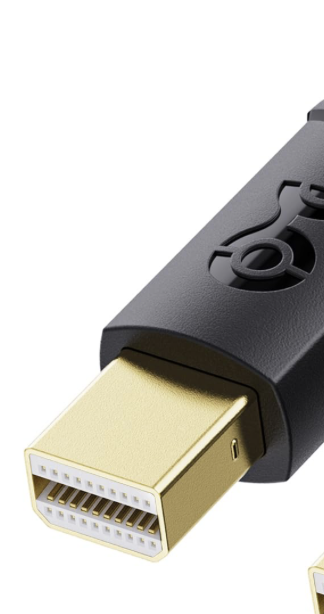
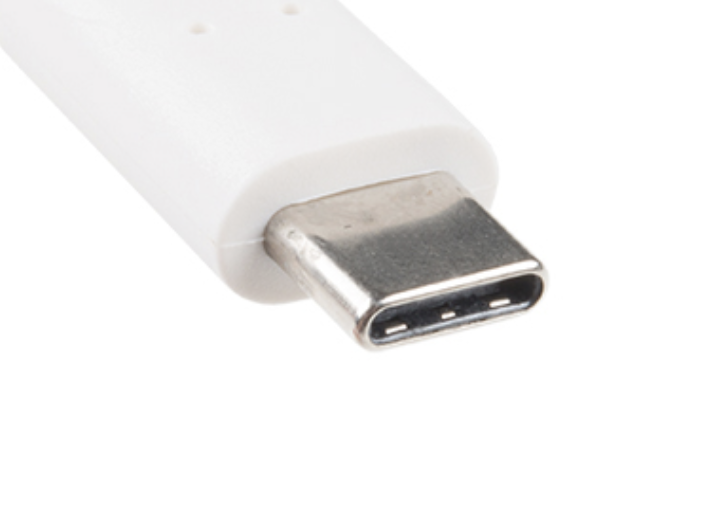

[Seite 2](index2.html)
----

## Also los:

OS ist übrigens die Abkürzung 'Operating System' also bei Dir Catalina (10.15.7) - ist mir beim Durchlesen aufgefallen...

- so wie ich mir das vorgestellt hab geht's schon mal nicht :( - mein iMac ist einfach zuuuu alt und der sieht die Festplatte nicht (:( - ich hatte mich schon so gefreut)
- allerdings habe ich einen Plan B + C + D)
- Plan B: Ich habe mal einen Thunderbolt auf USB Adapter bestellt und werde es dann nochmal versuchen (sieht aber eher auch nicht so prickelnd aus)
- Plan C: Ich habe noch ein altes Macbook Pro (2012) und werde es damit versuchen
- Plan D: Ich versuche das OS via USB-2 auf eine externe Festplatte zu installieren und dann von dort zu booten (das sollte eigentlich klappen - dürfte allerdings ewig dauern)

Und weil ich eh unfit bin, hab ich das jetzt einfach mal mit Plan-D angefangen (also mit dem normalen USB-2)... Und siehe da - schon fertig und der iMac läuft von der externen Platte. Via USB-C sollte das also rucki-zucki gehen... und ggf. bootet der sogar schneller von der externen Disk - aber das wäre ja erstmal wurscht...

### Grundsätzlich:

Ich weiß nicht, was für Anschlüsse dein iMac hat - aber wenn er USB-C hat, dann wäre das ideal!!!  (Die Infos auf den Apple-Seiten sind TOTAL widersprüchlich - überall steht Thunderbolt/USB-C, aber die Bilder zeigen 2 Mini-Displayport Anschlüsse... - auf der Schnellstart-Anleitung hingegen sind zwei USB-C Anschlüsse abgebildet... - ich gehe mal davon aus, dass es USB-C ist... - oder Du schickst mir mal ein Bild von der Rückseite deines iMacs...).  Oder Du sagst mir, welche es sind -> Vergleichsbilder sind unten...

Das Ganze ist **WIRKLICH** super-einfach - du musst nur die SSD formatieren und dann das OS installieren. (Die Anleitung ist eigentlich kompliziereter, als das Ganze in Wirklichkeit ist...)

### 1. SSD formatieren:
Zuerst muss die T7 formatiert werden.
- Dazu öffnest du das Festplattendienstprogramm (Programme -> Dienstprogramme -> Festplattendienstprogramm) und wählst die T7 (links) aus.
- Dann klickst du auf Löschen und wählst als Format "APFS" aus. (Wenn "APFS" nicht in der Liste ist, dann wähle erst bei "Schema" "GUID-Partitionstabelle" aus - dann sollte APFS zur Auswahl stehen)
- Dann gibst du der Festplatte einen Namen (z.B. "R24T7") und klickst auf "Löschen".
- Das dauert einen Moment und dann ist die T7 fertig formatiert.
- Die SSD kannst Du jetzt abziehen und wieder anstecken oder einfach drin-lassen - das ist egal.

### 2. Catalina runterladen:
- hier klicken: https://apps.apple.com/de/app/macos-catalina/id1466841314?mt=12  öffnet den App Store und zeigt die Catalina Seite
- dann auf "Laden" klicken
- Das dauert eine Weile... warte einfach, bis der Download abgeschlossen ist und der Installer gestartet wird.
- Am besten beendest du den Installer gleich wieder, da wir ihn später noch brauchen (CMD-Q).
- Der Installer liegt jetzt im Programme-Ordner und heißt "Install macOS Catalina.app" (oder "MacOS Datalina Installieren.app", oder so...)
- Jetzt startest du den Installer vom Programme-Ordner
- Der fragt dich jetzt WO du Catalina installieren willst und bietet zunächst die interne Festplatte an - aber das ist egal, da wir es ja auf die T7 installieren wollen.
- Also klickst du auf "Weitere Festplatten/Volumes anzeigen" und wählst die T7 aus.
- Jetzt sagst Du "Installieren" und dann wird Catalina auf die T7 installiert.
- Das dauert eine Weile... warte einfach, bis der Installer fertig ist.
- Dann startet der Rechner neu und du kannst von der T7 booten.

Das war's auch schon - jetzt kannst du von der T7 booten und Catalina benutzen.

#### Mini Displayport:

#### USB-C:
