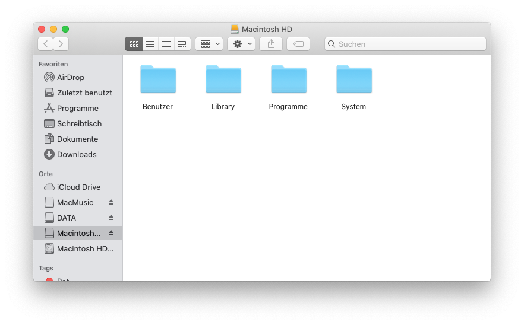
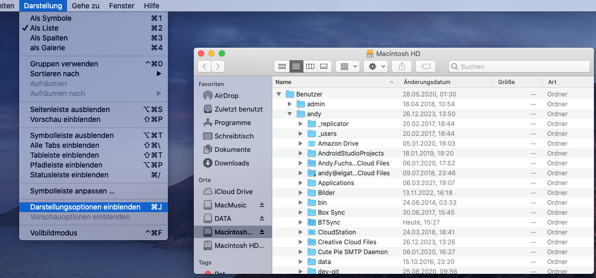
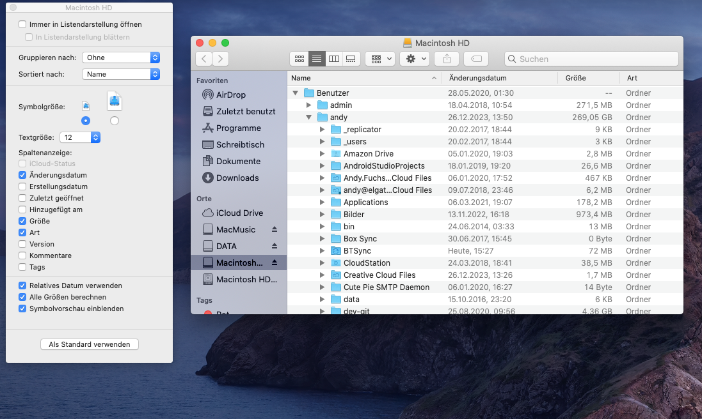

[Seite 2](index1.html)

Nachdem Du auf der SSD dann mal ein System laufen hast, würde ich folgendes machen:

### iCloud:
- Erstmal die iCloud anschalten - dann siehst Du (nach einiger Zeit), welche Daten Du in der Cloud (Mails, Fotos, Dokumente, etc...). Das ist schon mal ein guter Anfang - und Du hast das aus dem Kopf!
- Am besten gehst Du mal einen Kaffee trinken und öffnest dann mal Mail, Fotos, etc... und schaust, was alles da ist. Das dauert natürlich eine ganze Weile, bis alles synchronisiert ist.

Danach - oder parallel - schaust Du, was auf der alten Platte so alles drauf ist.
So würde ich vorgehen:

### Darstellung:

- "Macintosh HD" (die alte) doppelt anklicken -> dann siehst Du die Ordnerstruktur 
 
- Im Finder-Menü 'Darstellung' wählst Du 'Als Liste'.
- Dann gehst Du im Finder-Menü 'Darstellung' auf 'Pfadleiste einblenden'
- dann hast du alle Infos auf einen Blick  

- Jetzt gehst Du im Finder-Menü 'Darstellung' auf "Darstellungsoptionen einblenden" (CMD-J) 
  

- und wählst dort (unten) "Alle Größen berechnen" (kann etwas dauern) dann siehst Du neben allen Ordnern auch die Größe der Ordner
 
- Dann kannst Du Dir überlegen, was Du löschen willst - oder ob Du die Daten auf eine externe Platte kopieren willst. Jedenfalls hast Du jetzt einen Überblick, was auf der Platte ist und wie groß die Ordner sind. (Mit klicken auf den Spaltenkopf kannst Du die Ordner auch nach Größe, oder sonstwas, sortieren).

### Benutzerdaten:

Die meisten Daten sollten in deinem Benutzer-Ordner liegen. Da kannst Du schon mal analysieren, wo die meisten Daten verbraten werden. Jetzt kannst Du erstmal deine wichtigen Daten auf die SSD ziehen - die SSD ist groß genug!!. Das kann natürlich dauern - je nachdem, wieviel Daten da sind. 

Je nachdem - wie groß dein Benutzerordner ist, kannst Du den ganzen Ordner auch auch komplett auf die SSD kopieren - dann hast Du alle Daten auf der SSD und damit quasi ein Backup :)

Im Grunde müsstest Du jetzt auch schon gesehen haben, wo die meisten Daten abgeblieben sind. Wenn das irgendwo keinen Sinn macht, dann schick mir einen Screenshot von der Ordnerstruktur und ich schau mir das mal an.

#### Mail, etc...:

Mit den Mails musst Du etwas vorsichtig sein - die liegen in einem versteckten Ordner (nicht im Benutzerordner). Ist aber eigentlich auch unwichig, da die Mails ja auf dem Server liegen (ich hoffe mal Du hast keine POP-Server, sondern iMap - ist aber auch eigentlich die Regel). Was für eine Art Mailserver Du hast, kannst Du in den Einstellungen von Mail sehen. Bzw. wenn Du die Mails parallel auf dem iPhone/iPad und auf dem Mac hast, dann sind die Mails auf dem Server - dann brauchst Du Dir ÜBERHAUPT keine Gedanken machen.

> Wenn Du die Mails lokal gespeichert hast, dann liegen die im Ordner `Macintosh HD/<Benutzername>/Library/Mail` - den kannst Du auch auf die SSD kopieren.

Alles weitere sehen wir dann...
 